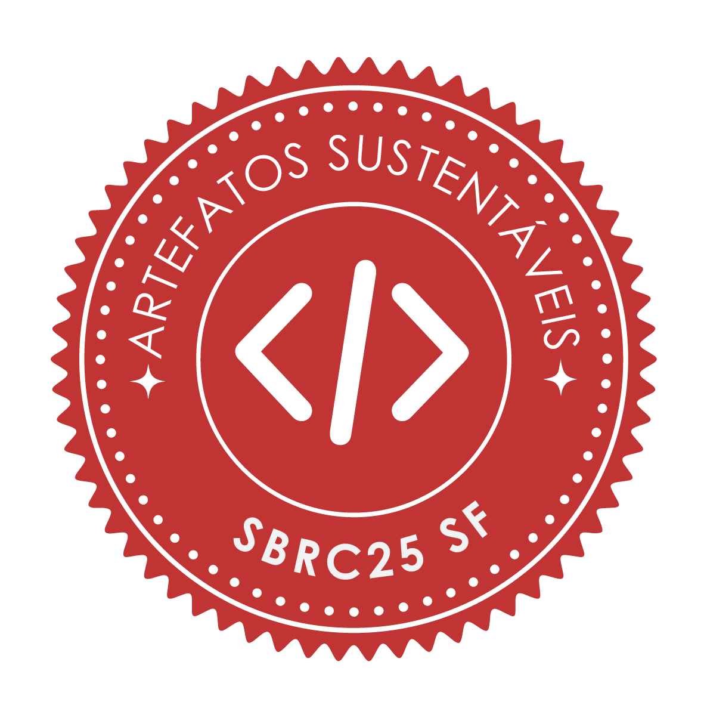
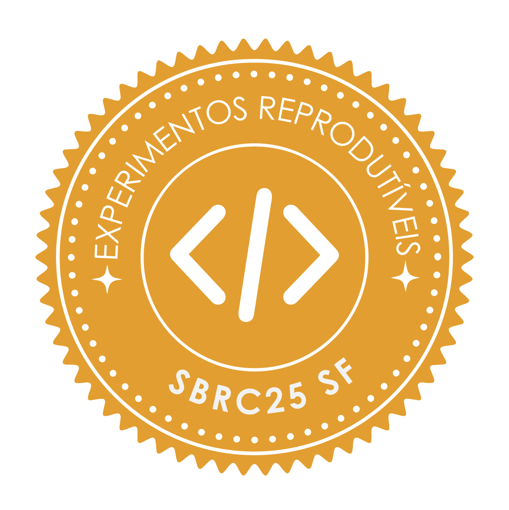

# Resultados

## Trabalhos com Selos Atribuídos

### Trilha Principal (TP)

|  Disp.  |  Func. | Sus. | Repr. |  Título do Trabalho |
| --------- | --------- | --------- | --------- | --------- |
|  |  |  |  | Agente K-alibra: Estratégia para Seleção de K-Clientes em Aprendizado Federado autônoma |
|  |  |  |  | Unsupervised DDoS Detection in High-Speed Networks: An Evaluation Using Real Transit Provider Data |
|  |  |  |  | Flex-Cubic: A Runtime-Adaptive Loss-Tolerant TCP Cubic |
|  |  |  |  | GlobalAmBC-DRL: Reproducible Artifact for "A New Centralized DRL-Based Control Module for Dense Batteryless IoT Networks with Ambient Backscatter" |
|  |  |  |  | ORION: Escalonamento de Tarefas baseado em Otimização Multiobjetivo para Nuvens Veiculares |
|  |  |  |  | PRINCE: A Proactive Client Selection in Federated Learning for Connected and Autonomous Vehicles |
|  |  |  |  | CAIROS: Controle Adaptativo do aprendIzado fedeRadO em redes Sem fio |
|  |  |  |  | Tronco: Um Operador Genético para Remapeamento de Serviços de Rede Sensível ao Histórico |
|  |  |  |  | Aprendizado Federado com Geração de Embeddings para Controle da Heterogeneidade Estatística |
|  |  |  |  | Ataques de Envenenamento de Rótulos contra a Detecção de Zero-Day em Sistemas de Detecção de Intrusão Colaborativos |
|  |  |  |  | Seleção de Clientes Federados usando Aprendizado por Reforço Multiagente |
|  |  |  |  | Modelagem e Otimização do Aprendizado Federado para Justiça do Nível de Energia em Redes Sem Fio |
|  |  |  |  | Avaliação de Inferência em Edge AI sob Restrições Embarcadas em um Sistema Robótico Simulado Baseado na Internet das Coisas Robóticas |
|  |  |  |  | Uma Análise Comparativa de Algoritmos de Machine Learning e Explicabilidade para Detecção de Intrusão de Redes |
|  |  |  |  | Recomendação de rotas consciente de QoE com Atenção e Comunicação |
|  |  |  |  | Uma Extensão Pós-Quântica Híbrida para o Protocolo Matrix: Avaliação Experimental e Impacto Sistêmico |
|  |  |  |  | IMPA: Novo algoritmo para atribuição de potência de forma adaptativa em SDM-EONs |
|  |  |  |  | Uma Abordagem Declarativa e Modular para Adaptação Dinâmica da Camada de Enlace de Redes Heterogêneas |
|  |  |  |  | Agente VAMOS! Planejamento de Rotas Veiculares Cientes de Contexto Semântico com Agentes de LLM |
|  |  |  |  | NOAH: Protocolo Hibrido e Adaptativo de Codificação de Rede para Comunicação por Luz Visível |
|  |  |  |  | ASTRA: Adaptive Student-Teacher Method for Robust Aggregation and Client Drift Reduction in Federated Learning |
|  |  |  |  | Mascaramento por Agrupamento e Rotulagem com LLMs para Compartilhamento de Datasets de Incidentes em Redes |
|  |  |  |  | Detecção de Oportunidades de Sanduíche MEV via Grafo de Fluxo de Controle de Contratos Inteligentes |
|  |  |  |  | C2N: Bridging CAMARA Service APIs and 3GPP Core Network Exposure Function |
|  |  |  |  | Ember: Asynchronous Dynamic Data Serving for PyTorch Distributed Training |
|  |  |  |  | An Experimental Framework for Studying Non-IID Data in Federated Learning for Network Telemetry |
|  |  |  |  | Comparative Performance Analysis of IaC Tools for Deploying Containerized SDN Topologies in Cloud Environments |
|  |  |  |  | On the Scale Transition of Event-Driven IoT Architectures: An Experimental Evaluation |
|  |  |  |  | Evasão em Modelos de Detecção de Ameaças de Rede Usando Propriedades do Espaço de Decisão |
|  |  |  |  | Orquestração de dispositivos IoT em cenários complexos com interação humana baseada em LLMs |
|  |  |  |  | Degradação de Desempenho de Contramedidas Estáticas a Ataques de Negação de Serviço de Baixo Volume |
|  |  |  |  | Do Aprendizado Centralizado ao Federado: O Que Acontece com a Explicabilidade dos Modelos? |
|  |  |  |  | Escalonamento de Recursos de Rádio para Suporte ao Aprendizado Federado em Redes 5G |
|  |  |  |  | Cybersecurity in the CAN Protocol: A Systematic Mapping of Attacks and Vulnerabilities in Practical Scenarios |
|  |  |  |  | Latency-Aware Routing and Multidimensional Optical Resource Allocation for CF-RAN over SDM-EON |
|  |  |  |  | Framework para Verificação e Validação Experimental de Configurações de Rede Geradas por LLMs |
|  |  |  |  | Enforcing Service Stability for WebAssembly Extended Reality Workloads at the Edge A Quality of Service Aware Orchestration Framework |
|  |  |  |  | Representação Baseada em Grafos de Infraestrutura como Código: Possibilitando o Raciocínio Semântico para Sistemas Conteinerizados |

### Salão de Ferramentas (SF)

|  Disp.  |  Func. | Sus. | Repr. |  Título do Trabalho |
| --------- | --------- | --------- | --------- | --------- |
|  |  |  |  | QuantumNet: Um Simulador de Redes Quânticas baseado em uma Arquitetura em Camadas com Interface Gráfica |
|  |  |  |  | AnonShield: Scalable On-Premise Pseudonymization for CSIRT Network Vulnerability Data |
|  |  |  |  | UNetyEmuROS: A Unity-Based Multi-Vehicle Simulator with Physically-Grounded Dynamics and ROS2 Sensor Integration |
|  |  |  |  | IoT-Zoo: A Container-Based Framework for Heterogeneous IoT Device Profiles and Reproducible Traffic Capture |
|  |  |  |  | From Red Flags to Detection Rules: An LLM-driven Pipeline for Real-Time GOOSE Intrusion Detection and Prevention |
|  |  |  |  | GhostView: Enabling Deep Visibility in Programmable Data Planes with Minimal Server Overhead |
|  |  |  |  | Yes, CARLA CAN: Extending the CARLA Simulator for In-Vehicle Network Cybersecurity Experimentation |
|  |  |  |  | GridGooseSV: um Módulo do NS-3 para Simular Protocolos de Comunicação de Smart Grids definidos na IEC 61850 |
|  |  |  |  | FirewallTester: desenvolvimento de ferramenta para automação de testes e validação de regras de firewalls |
|  |  |  |  | SAARIS: Um Simulador Aberto de Antenas e Superfícies Inteligentes Reconfiguráveis |
|  |  |  |  | IoT-ID: Deterministic Device Identity from Hybrid Network Fingerprinting |
|  |  |  |  | dsm2cli: A Verifiable and Observable Pipeline for Translating Network Intents into Multivendor CLI |
|  |  |  |  | FL-H.IAAC: Um Testbed Heterogêneo para Aprendizado Federado em Borda |
|  |  |  |  | The Last WAVE: Integrating with Mininet for More Flexible and Reproducible Network Experiments |
|  |  |  |  | MedTracker: A BLE-Based Indoor Localization System for Tracking Portable Medical Devices in Hospital Environments |
|  |  |  |  | FLeer2FLeer: Uma Ferramenta Web Baseada em Arquitetura Par-a-Par para Orquestração do Aprendizado Federado |
|  |  |  |  | P4R: Scaling Stateful Network Testing and Trace Replay with Nanosecond-level Accuracy |
|  |  |  |  | Metadata privacy and obliviousness in distributed learning via a bulletin board: a proof-of-concept |
|  |  |  |  | WASP: Workload Agent-Based Simulation Platform for Migration Recommendations in Federated Kubernetes Environments |
|  |  |  |  | SimpleSim: An Open-Source Python Simulator for SDM-EON Resource Allocation |

## Trabalhos Destaque na Categoria Artefatos

TBA     

## Revisores Destaque

TBA     
