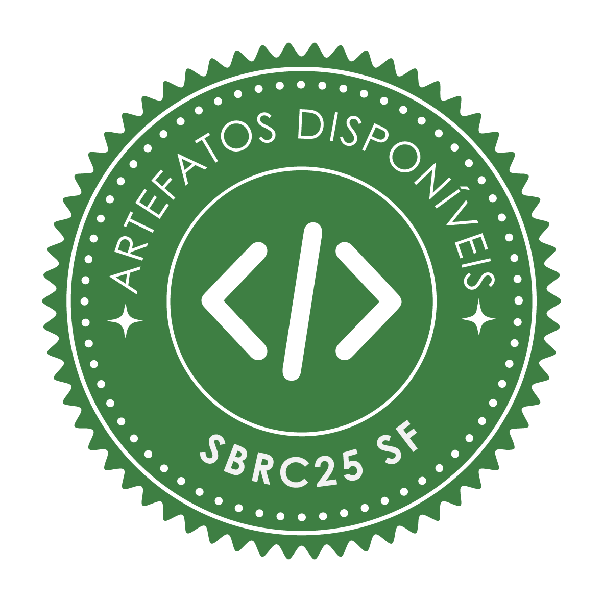
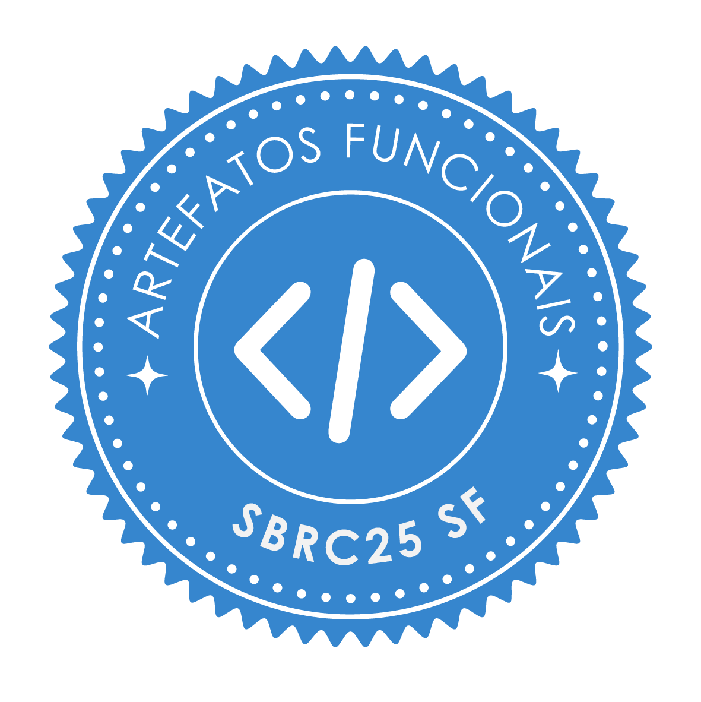
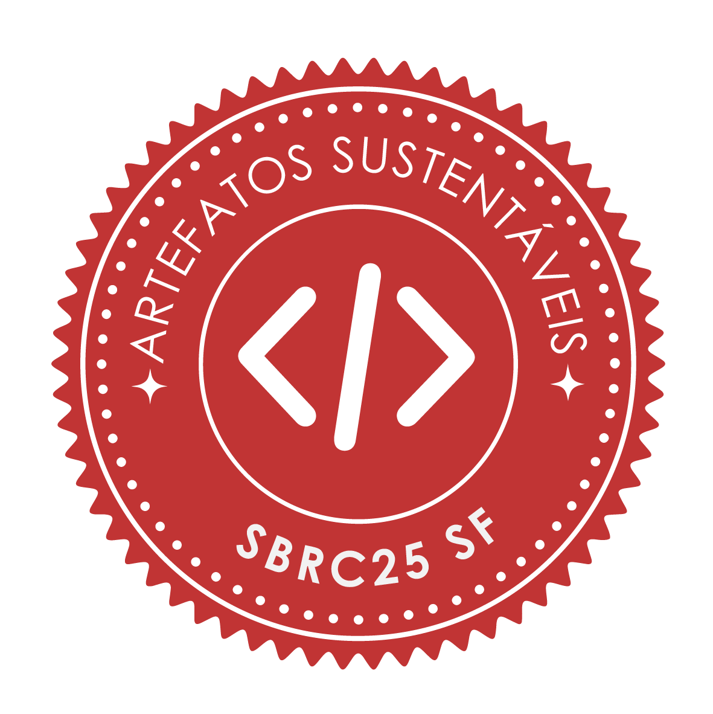
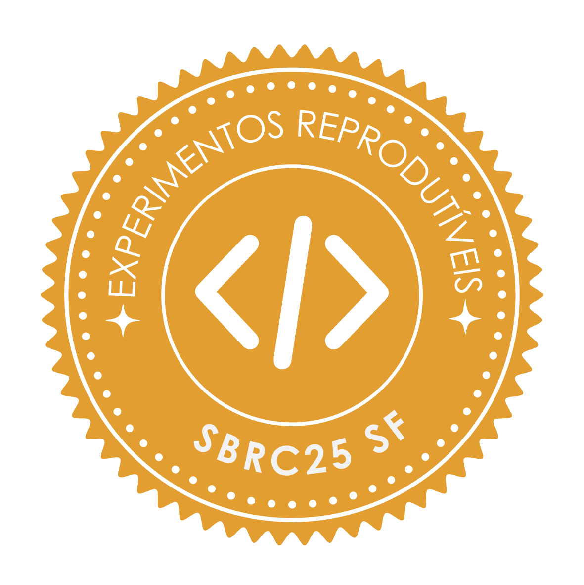

# Resultados

## Trabalhos com Selos Atribuídos

### Trilha Principal (TP)

|  Disp.  |  Func. | Sus. | Repr. |  Título do Trabalho | Artefato |
| --------- | --------- | --------- | --------- | --------- | --------- |
|  |  |  |  | Uma Abordagem Baseada em LLMs Open-Weight para Detecção e Classificação de Vulnerabilidades em Relatórios OSINT | [Repositório](https://github.com/xkalibrain/SBSeg2026/tree/main) |
|  |  |  |  | CodeBERT Detection Pipeline for SQL Injection Detection: A Comparison with other ML Models| [Repositório](https://github.com/l-a-motta/sbseg2026-codebert-sqli) |
|  |  |  | | Sentry: Uma Contramedida Adaptativa contra Ataques de Negação de Serviço de Baixo Volume | [Repositório](https://github.com/brumesan/Countermeasure-LDoS-SDN-2026) |
|  |  |  |  | WebTrap: Uma ferramenta de detecção de ataques em requisições HTTP utilizando Aprendizado de Máquina| [Repositório](https://github.com/pedro-hfw/webtrap-sbseg26) |
|  |  |  |  | Design, Formal Verification, and Evaluation of a Post-Quantum EDHOC Variant for UAV Communications| [Repositório](https://github.com/regras/pq-edhoc-tamarin) |
|  |  |  |  |When Balancing Harms: Structural Conditions That Degrade Android Malware Detection After Class Imbalance Correction | [Repositório](https://github.com/AILabs4All/datasets-mh30plus) |
|  |  |  |  | $1 Yacht Sale: Tampering with Signed PDFs in Plain Sight| [Repositório](https://github.com/enzoBrum/sbseg-paper) |
|  |  |  | | Statistical Ranking: A Voting-Based Ensemble Approach to Feature Selection in Android Malware Detection| [Repositório](https://github.com/annalug/feature_selection_pipeline) |
|  |  |  |  | Do Bruto ao Brilho: Compactação Semântica com Preservação de Proveniência para Traços Dinâmicos de Malware Android| [Repositório](https://github.com/secretrdlab/SELENE) |
|  |  |  |  | Uma Ferramenta para Classificação de Tráfego Cifrado em VPNs sem Inspeção da Carga Útil dos Pacotes| [Repositório](https://github.com/enzobasaldella/vpn-encrypted-traffic-classification-sbseg-2026) |
|  |  |  |  | OIDC4AC: Extending OpenID Connect for Structured and Negotiable Authentication Contexts| [Repositório](https://github.com/Bredstone/Keycloak-OIDC4AC-Lab/tree/sbseg2026-artifact) |
|  |  |  |  | Desenvolvimento de um testbed para implementação e avaliaço de protocolos de segurança em redes veiculares| [Repositório](https://github.com/regras/vnx-security-testbed/tree/main) |
|  | |  | |MulitaMiner: A Multi-Version Evaluation of LLM-Based Vulnerability Report Extraction | [Repositório](https://github.com/AnonShield/MulitaMiner/tree/V3) |
|  |  |  |  | A Uniform Random-Sample Security Measurement of Docker Hub Images| [Repositório](https://github.com/ChimangoScan/chimango-baseline) |
|  |  |  |  | A Multi-Scanner Census of the Linux Operating-System Base Images of Docker Hub| [Repositório](https://github.com/ChimangoScan/os-census) |
|  |  |  |  | Not All 4-bit Quantizers Are Equal: Deployment-Time Mitigation of PII Leakage in Fine-Tuned Small Language Models| [Repositório](https://github.com/CristhianKapelinski/quantizer-pii-mitigation) |
|  |  |  |  | Context-Aware SIEM Rule Generation with LLMs: When Site Profiles Are Not Enough| [Repositório](https://github.com/CristhianKapelinski/wazuh-study) |
|  |  |  |  | UFU-Do53-EXF e UFU-DoH-EXF: conjuntos de dados para detecção de exfiltração via DNS | [Repositório](https://github.com/CborgesUFU/DNS-360-Dataset) |
|  |  |  |  | Análise Automatizada de Logs de Instrumentação Binária Dinâmica para Identificação de Comportamentos Evasivos em Executáveis Windows| [Repositório](https://github.com/dbilog) |
|  |  |  | | Longitudinal Analysis of iOS In-App Purchase Implementation Vulnerabilities| [Repositório](https://github.com/izmcm/bypass-iap-ios) |
|  |  |  |  |VeritaPlugin: Uma Extensao de Navegador para Detecção Semântica de Fraudes no Facebook | [Repositório](https://github.com/brunanoroes/VeritaPlugin) |
|  |  |  |  | Avaliação de Risco usando Engenharia de Prompt em LLMs| [Repositório](https://github.com/ArthurLabaki/prompt-engineering-cyber-risk-m) |
|  |  |  |  | Auditing Technical Security Debt through Retrieval-Augmented Generation: A CWE-, CAPEC-, and STRIDE-Based Approach| [Repositório](https://github.com/KleitonEwerton/Auditing-Technical-Security-Debt-through-Retrieval-AugmentedGeneration) |
|  | |  |  | Uma Arquitetura de Aprendizado Federado Homomórfica para Treinamento de LSSVM usando CKKS e Decomposição QR de Householder| [Repositório](https://github.com/victorfariafernandes/homomorphic-cli/tree/sbseg-public-release) |
|  |  |  |  | Detecção Direta versus Indireta em Pipelines DevSecOps: Análise de Ruído Taxonômico e Calibração de Portões de Segurança Progressivos| [Repositório](https://github.com/Machada1/sbseg2026-deteccao-direta-indireta) |
|  |  |  |  | Delta-XMSS: Incremental State Optimization for Post-Quantum Hash-Based Signatures| [Repositório](https://github.com/antonioatra/xmss-reference) |
|  |  |  | | GPU Acceleration of VOLEitH-Based Post-Quantum Signatures: A Reusable Fragment-Graph Framework | [Repositório](https://github.com/shyba/gpu-vole) |
|  |  | |  | Crypto-Agile Ethereum Transactions: A Hybrid Post-Quantum Architecture for Besu| [Repositório](https://doi.org/10.5281/zenodo.20347079) |
|  |  |  |  | Security-First Evaluation of Text-to-Terraform: Benchmarking LLMs and SLMs for Secure IaC Generation| [Repositório](https://gitlab.com/security-iac/security-first-evaluation-of-text-to-terraform/-/tags/sbseg-trilha-principal) |
|   |  |  |  |Retrofitting Intel CET’s Indirect Branch Tracking into Legacy Binaries through Static Binary Rewriting | [Repositório](https://zenodo.org/records/20420793) |
|  |  |  |  | EDNS0 como Vetor Adversarial: Lacunas de Visibilidade Empírica em Ferramentas Populares de DPI e Detecção de Intrusão | [Repositório](https://github.com/the-red-ace/edns0-arbitrary) |
|  |  | | | DAST-AI: Reducing False Positives in API Security Testing via LLM-based Semantic Analysis | [Repositório](https://github.com/gabrielfelipo/dast-ai-artifact) |
| |  |  |  | BAGLEY: Orquestração Automatizada Baseada em LLM de Ciclos de Purple Teaming e MITRE CALDERA| [Repositório](https://github.com/juniorealmente/bagley-llm-caldera-orchestrator.git) |
|  |  |  | | Fusão de Características em Espaços Vetoriais para Detecção Estática de Cryptojacking em WebAssembly | [Repositório](https://github.com/yekwim/wasm_crypto_finder) |
|  |  |  |  | Análise e melhoria da segurança de aplicação do padrão T-REX na emissão de tokens fungíveis e não fungíveis para certificados de energia renovável | [Repositório](https://github.com/vjr-joseroberto/diamond-erc3643-hardening) |
|  |  |  | | Network Flow Integration to Improve Generalization of Machine Learning-Based IDS | [Repositório](https://github.com/kelsonc/paper-sbseg2026) |
|  | | |  | Além da Distância Linguística: Jailbreaks Multilíngues em LLMs Especializados por Idioma | [Repositório](https://github.com/gabrieljcs/ufsc-thesis-sbseg2026) |
|  |  | | | BraZKIL: um Framework híbrido para verificação de maioridade via SSI, DID/VC e Divulgação Seletiva em conformidade com o ECA Digital | [Repositório](https://github.com/otavio-alv/BraZKIL) |
|  |  |  |  |Supporting Upstream Vulnerability Triage in Fork-Based Development | [Repositório](https://github.com/lincolnrocha/PaperSBSeg2026) |
|  |  |  |  | Autonomous Red Teaming for Large Language Models: A Minimally Supervised Approach Using Specialized Agents | [Repositório](https://github.com/deboradcm/RedTeam_Calvin) |
|  |  |  |  | On the concrete hardness of the Approximate GCD problem | [Repositório](https://github.com/ericlesaquiles/lattice-estimator/tree/agcd) |
|  |  |  | | Characterizing Malware-as-a-Service-Oriented Android Fraud Campaigns Targeting Brazil| [Repositório](https://github.com/renandamasceno/android-maas-brazil-replication-package) |
|  |  |  |  | Evaluating Lightweight Transformers for Network Intrusion Detection under Temporal Drift: A Comparative Study with MAWIFlow | [Repositório](https://github.com/JohnGarden/sbseg26-LiFT-NIDS) |

### Salão de Ferramentas (SF)

|  Disp.  |  Func. | Sus. | Repr. |  Título do Trabalho | Artefato |
| --------- | --------- | --------- | --------- | --------- | --------- |
|  |  |  |  | AIaCGateGuard: A Security-First Pipeline for Benchmarking LLM- and SLM-Generated Infrastructure-as-Code | [Repositório](https://gitlab.com/security-iac/security-first-evaluation-of-text-to-terraform/-/releases/sbseg-sf) |
|  |  |  |  | AdminForge: Declarative Privileged-Identity Management for Linux Server Fleets| [Repositório](https://github.com/BagualOps/adminforge-sbseg2026) |
|  |  |  |  | ZeroLINC: Training-Free Local Classification of Security Incident Reports| [Repositório](https://github.com/CristhianKapelinski/zerolinc) |
|  |  |  |  |AttackZoo: A Reproducible Testbed for Attack Execution and Network Traffic Dataset Generation | [Repositório](https://github.com/GT-IoTEdu/attackzoo-sbseg26) |
|  |  |  |  | MulitaMiner: An LLM-Based Tool for Structuring Vulnerability Scanner Reports| [Repositório](https://github.com/tooltmm-png/TMM) |
|  |  |  |  | SecureForge Web: Avaliação Guiada e Hardening de Aplicações Web com Análise Assistida | [Repositório](https://github.com/secureforgeweb) |
|  |  |  |  | TopVenues: An Executable Corpus and Research Tool for Cybersecurity Literature Reviews | [Repositório](https://github.com/sidneibarbieri/topvenues-tool) |
|  |  |  |  | PQCinBlock: uma ferramenta para análise do impacto de algoritmos de Criptografia Pós-Quântica em blockchains via benchmark e simulação| [Repositório](https://github.com/conseg/PQCinBlock) |
|  |  |  | | GT-LFI: Anonimização, Classificação e Aprendizagem Gamificada a partir de Incidentes Reais | [Repositório](https://github.com/rsmiani/gt-lfi-rnp) |
|  |  |  | | RV4Android: An End-to-End Pipeline for Runtime Verification of Cryptographic API Specifications on Contemporary Android Applications | [Repositório](https://github.com/phtcosta/sbseg2026-replication-pack) |
|  |  |  |  | Triager: An Open-Source Platform for Automated Forensic Triage and Investigation| [Repositório](https://gitlab.com/cristianzsh/triager-sbseg) |
|  |  |  |  | AmCache-EvilHunter: Automating Evidence of Execution Extraction from the Amcache.hve Artifact | [Repositório](https://gitlab.com/cristianzsh/amcache-evilhunter-sbseg) |
|  |  |  |  | FridaForge: Geração Automatizada de Scripts Frida com Contexto Dinâmico da Aplicação | [Repositório](https://github.com/FranciscoSalesCarvalho/android_instrumentation) |
|  |  |  |  | Typhon DB Sentry: Practical Queryable Column-Level Encryption with Fast Format-Preserving Decryption | [Repositório](https://github.com/kryptus-sa/typhon-sbseg2026-artifact) |
|  |  |  |  | DefendGraph: Sistema Especialista Semântico para Alertas Wazuh com MITRE D3FEND | [Repositório](https://github.com/felipethomas82/DefendGraph) |
|  |  |  |  | IoTEdu Core: Multi-IDS Correlation and Automated Containment of Attacks in Institutional IoT Networks | [Repositório](https://github.com/GT-IoTEdu/iotedu-core_sbseg26) |
|  |  |  |  | Toward Agentic Intrusion Detection in the Internet of Things: Rule Generation and Live Validation for XRCE-DDS Attacks| [Repositório](https://github.com/GT-IoTEdu/rules-farmer_sbseg26) |
|  |  |  |  | KETRIN: Elicitação Adaptativa de Conhecimento para Diagnóstico de Maturidade em Proteção de Dados| [Repositório](https://github.com/KetrinDiovanaVargas/PlatformLGPDCompliance) |
|  |  |  |  | ComplianceNet: Uma ferramenta de governança contínua no gerenciamento de redes baseadas em NETCONF| [Repositório](https://github.com/jps-pereira/ComplianceNet) |
|  |  |  |  | Extensões ao DefectDojo para Priorização de Vulnerabilidades | [Repositório](https://github.com/secure-net-systems/django-DefectDojo/blob/crivo-rnp/readme-docs/SBSEG-README.md) |
|  |  |  | | SHOGUN: An Integrated Dashboard for Vulnerability Analysis via Internet-Wide Search Engines | [Repositório](https://github.com/lucasmsp/shogun-dashboard/tree/readme_sbseg ) |

### Workshop de Trabalhos de Iniciação Científica e de Graduação (WTICG)

|  Disp.  |  Func. | Sus. | Repr. |  Título do Trabalho | Artefato |
| --------- | --------- | --------- | --------- | --------- | --------- |
|  |  |  |  | CryptoCensus: Cryptographic Posture and Post-Quantum Readiness of Docker Hub | [Repositório](https://github.com/CristhianKapelinski/cryptocensus) |
|  |  |  |  | RAGtrap: Source Revocation and Indexed Provenance Lookup for Poisoned RAG Corpora | [Repositório](https://github.com/CristhianKapelinski/sbseg2026-ragtrap) |
|  |  |  |  | PixGuard-Sim: A Deadline-Aware Testbed for Pix Fraud Detectors | [Repositório](https://github.com/CristhianKapelinski/sbseg2026-pixguard-sim) |
|  |  |  |  | On-Premise vs. Cloud: Local LLMs for Vulnerability Extraction from Security Scanner Reports | [Repositório](https://github.com/AnonShield/MulitaMiner/tree/slms) |
|  |  |  |  | Implementação e avaliação do algoritmo pós-quântico ML-KEM em smart cards | [Repositório](https://github.com/regras/mlkem-on-simcard) |

## Trabalhos Destaque na Categoria Artefatos

TBA     

## Revisores Destaque

TBA     
